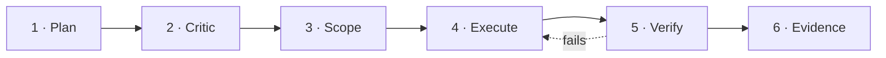

<div align="center">


# Do-Me-Coding

**Do not just suggest. Do the work. Prove the work. Do not fake completion.**

A Claude-Code-first enforcement harness that forces AI coding agents to plan, critique,
implement, verify, recover, and report — with evidence.

[](https://github.com/wjlee930501/Do-Me-Coding/actions/workflows/dmc-ci.yml)

[Install](#install) · [The loop](#the-inviolable-loop) · [Commands](#commands) · [Constitution](docs/DMC_CONSTITUTION.md)

</div>

## Install

DMC installs into an existing Claude Code or Codex repo. First success is one command;
the second command proves it worked.

```bash
# 1 — get the harness
git clone https://github.com/wjlee930501/Do-Me-Coding
cd Do-Me-Coding

# 2 — install into your project (Claude Code + Codex)
bash .claude/install/dmc-install.sh ~/code/your-repo --host both

# 3 — verify it worked
bin/dmc doctor
```

`--host` accepts `claude` (default), `codex`, or `both`. Add `--dry-run` to preview every file it
would write, or `--mode active|passive|off` to set enforcement strength. The installer merges into
your repo without overwriting your own files.

### Verify it worked

`bin/dmc doctor` runs a fast, offline host self-check — interpreters, Ring-0 guards, hook
dispatch — so you can *see* the enforcement is live rather than assume it.

## The inviolable loop

Every substantial change runs six stages, in order. The critic is never skipped; the verifier
never grades its own work.



> **No verification, no done. No accepted scope, no edit. No evidence, no completion claim.**

## What it enforces

Guidance is a suggestion an agent can ignore. DMC ships deterministic guards that hold regardless
of the model's mood.

| Guard | What it does |
| --- | --- |
| **Scope-lock** | A compiled lock lists exactly which files may change. Writes outside it — including Bash-mediated ones — are refused. |
| **Release gate** | Nine sub-gates: diff-scope, gate-checks, receipts, findings, goal, decision, approvals, chain, landmark-flag. FAIL dominates; PARTIAL never passes. |
| **Evidence ledger** | Completion is a record, not an assertion — verification refs, minted receipts, an append-only approvals chain. |
| **Secret guard** | `.env`, private keys, and credential files are off-limits to every tool, in every mode — by filename, defense-in-depth. |
| **Non-authoring critic** | The reviewer and the verifier run in separate lanes from whoever wrote the code. Self-approval is structurally impossible. |
| **Portable control plane** | One deterministic `bin/dmc` CLI plus hooks that ride along with Claude Code and Codex. No daemon, no lock-in. |

## Commands

Slash commands for each stage — or just end any prompt with `dmc` and the router runs the full loop.

| Command | What it does |
| --- | --- |
| `/dmc-plan-hard` | Produce a decision-complete, schema-valid plan bound to the run. |
| `/dmc-critic` | Adversarial review that must APPROVE before any implementation. |
| `/dmc-start-work` | Arm a run and compile the scope-lock for an approved plan. |
| `/dmc-verify-hard` | Independent verification before any completion claim. |
| `/dmc-ultrawork` | The full plan → critic → scope → execute → verify → evidence cycle. |
| `… dmc` | Natural trigger — end a request with `dmc` to route the whole loop. (`dmc-plan` plans only; `dmc-off` stands enforcement down.) |

## What is this?

Do-Me-Coding is a Claude-Code-first execution harness that forces AI coding agents to plan,
critique, implement, verify, recover, and report with evidence. It works alongside Claude Code and
Codex, driven by a portable `bin/dmc` control plane — no daemon, no lock-in.

Enforcement strength is one switch: `.harness/mode` = `active` (full), `passive` (deny-tier only),
or `off` (catastrophic + secret-exposure deny only). Absent means `active`.

## Governed by a constitution

DMC's own rules are written down, adversarially law-reviewed, and self-entrenching — see
**[the Constitution](docs/DMC_CONSTITUTION.md)** (Articles I–VIII: supremacy, machine-fact primacy,
the amendment procedure, honesty discipline, human-gated override hatches, pinned baselines,
self-entrenchment, and maintainer duties — the inviolable loop, anti-patchwork, and escalation).

## Documentation

- **[DMC.md](DMC.md)** — the operating manual
- **[docs/DMC_CONSTITUTION.md](docs/DMC_CONSTITUTION.md)** — governance law
- **[docs/DMC_OPERATOR_HANDBOOK.md](docs/DMC_OPERATOR_HANDBOOK.md)** — day-to-day operation
- **[docs/OMC_COEXISTENCE.md](docs/OMC_COEXISTENCE.md)** — running alongside other orchestration layers

## License

[MIT](LICENSE) © 2026 Woojin Lee

---

<div align="center">
<sub>Claude-Code-first · works with Codex · MIT</sub>
</div>
